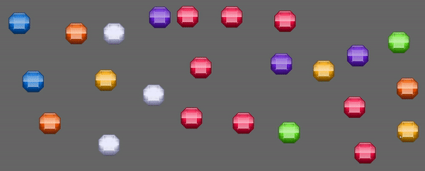

<div align="center">

# `bevy_scroller`

A small [Bevy](https://github.com/bevyengine/bevy) plugin to scroll things and create parallaxes.

[](https://crates.io/crates/bevy_scroller)
[](https://crates.io/crates/bevy_scroller)
[](https://docs.rs/bevy_scroller)
[](https://github.com/bevyengine/bevy/blob/main/docs/plugins_guidelines.md#main-branch-tracking)


</div>

## About

The idea is simple - you define an area for the scroller and select an item generator that will be responsible for generating items. Scroller will fill the area with items from this generator, update its position, track which items moved out of the area and need to be destroyed, and track when new items need to be generated. This plugin makes no assumptions as to what actually will be a scroller item. There are few predefined generators that implements common strategies to gerenerate sprites as scroller items. You can also [implement your own generators](#custom-generators) to scroll whatever you want ([tilemaps](#example_tilemap), animations, complex entity hierarchies, etc.).

By creating mutliple scrollers with different z-index, sprite and speed, you can easily create parallaxes ([example](#example_parallax)).

## Features

1. Scroll directions
1. Different scroll item sizes in same scroller
1. Render to texture
1. Pre-build generators for sprite items:
    1. Single - repeat single image
    1. Sequence - repeat sequence of images
    1. Random Sequence - scroller will consist of random images from sequence
1. Custom generators - define how exactly items should be generated and spawned

## Todo

- [ ] make it work with spritesheets
- [ ] scroller run conditions (when player moved, for instance)
- [ ] change scroll direction on the go
- [ ] some cases might be optimised with using shaders.

## Usage

spawn a scroller-entity with:
1. ScrollerSize component
1. Scroller component
1. If you want any of pre-build generators, attach ScrollerGenerator component

```rust
  commands.spawn((
    ScrollerGenerator::SpriteSingle("scroller_image.png".into()),
    ScrollerSize {
      size: Vec2::new(500., 300.),
    },
    ScrollerBundle {
      scroller: Scroller {
        speed: 1.,
        direction: ScrollerDirection::Forward,
        ..default()
      },
      ..default()
    },
  ));
```

## Custom Generators

Generating scroller item devied in 2 parts. First you describe how item will be generated. Second you describe how item should be spawned in the world.
You will need 2 structs (item and generator component) and 2 funtions (generator and spawner).

Define struct that will desribe generated item. This struct should implement `GeneratedItem` trait with `fn size(&self) -> Vec2` method so that item size is known. This struct will be passed to the spawner function so it has to contain all the information suffusion to spawn the item.

```rust
#[derive(Clone, Reflect, Debug)]
pub struct MyScrollerItem {
  pub size: Vec2,
}

impl GeneratedItem for MyScrollerItem {
  fn size(&self) -> Vec2 { self.size }
}
```

Define generator component. It will mark your generator and contain generator configuration.

```rust
#[derive(Component, Clone, Default)]
pub struct MyGenerator {}
```

Implement `ScrollerGenerator` trait for this struct. This includes implementing `gen_item` function which should contain item generation logic and return that item.

```rust

impl ScrollerGenerator for MySpriteGenerator {
  type I = MyScrollerItem;

  fn gen_item(&mut self) -> Self::I {
    Self::I {}
  }
}
```

Finally write spawner function that will spawn previously generated item. This should be regular bevy system that will additionally receive `In<Vec<(Entity, Scroller, Box<MyScrollerItem>)>>` so that you can know what actully to spawn.

Then add this generator with spawner to your app:
```rust
app.add_scroller_generator::<SingleSpriteGenerator, _, _>(sprite_spawner)
```

Also see existing generators ([sprite](src/generators/sprite.rs), [poisson](src/generators/poisson.rs)) for example of how you can implement your own.

## Examples

Run examples with

```
cargo run --example <example> --features=bevy/default --release
cargo run --example poisson --features=bevy/default,poisson --release
```

| example | preview | description |
|----|-----|---------------|
| [single](examples/parallax.rs) | | shows a basic usage |
| [sequence](examples/sequence.rs) | | shows a usage of sequence generator. It also shows how to wait while all assets are loaded and retrieve sprite size |
| [random_sequence](examples/random_sequence.rs) | | shows random sequence generator |
| [multiple](examples/multiple.rs) | | example of muptiple scrollers |
| [mirrors](examples/mirrors.rs) |  | example of how you can render scroller to texture and then use that texture to show this same scroller in other parts of applications |
| <span id="example_parallax"></span> [parallax](examples/parallax.rs) |  | showing how you can set up a parallax with this plugin |
| [poisson](examples/poisson.rs) |  | use of poisson generator to fill space with sprites and scroll them all. Set up radius to ensure that no entity generated closer than that radius. Run this example with additionall `poisson` feature |
| <span id="example_tilemap"></span> [tilemaps](examples/tilemap.rs) |  | Show how to use scrollers with tilemaps. It uses custom generator to generate scroller items with tilemaps based on [bevy_ecs_tilemap](https://github.com/StarArawn/bevy_ecs_tilemap) |

## Bevy Compatibility

| bevy | bevy_scroller |
|-|-
| 0.12.0 | 0.2.* |
| 0.11.0 | 0.1.* |


## Credits

- [gems](https://opengameart.org/content/gems-set-01)
- [parallax](https://ansimuz.itch.io/mountain-dusk-parallax-background)
- tilemap - [Cute Forest](https://aamatniekss.itch.io/free-pixelart-tileset-cute-forest) and [Ocean Background](https://opengameart.org/content/ocean-background)
- sprite_sheet - generated with https://old-flick.itch.io/sprite-randomizer

---
### License
<sup>
Licensed under either of <a href="LICENSE-APACHE">Apache License, Version
2.0</a> or <a href="LICENSE-MIT">MIT license</a> at your option.
</sup>
<br>
<sub>
Unless you explicitly state otherwise, any contribution intentionally submitted
for inclusion in this crate by you, as defined in the Apache-2.0 license, shall
be dual licensed as above, without any additional terms or conditions.
</sub>
